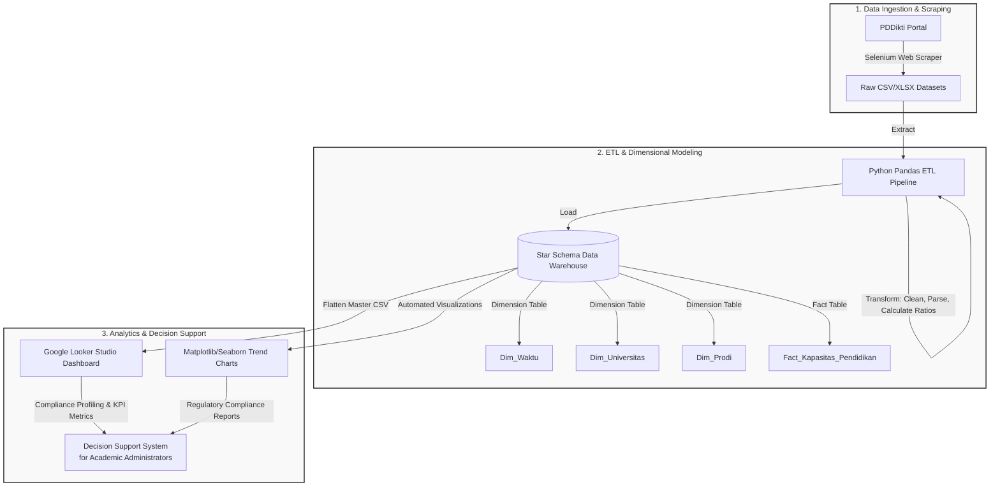
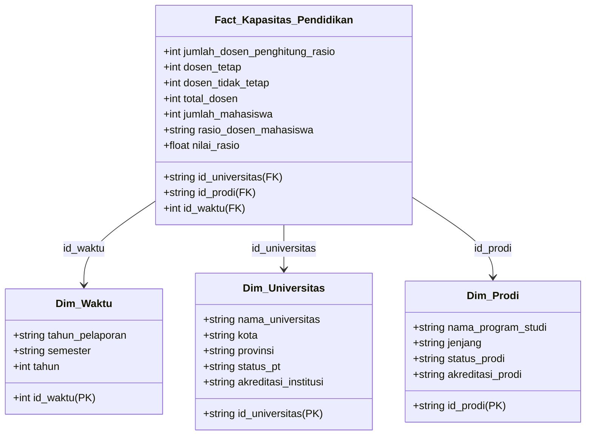

# Academic Capacity Decision Support System (DSS) using Business Intelligence (BI) Roadmap
   
[](https://www.python.org)
[](https://www.selenium.dev)
[](https://pandas.pydata.org)
[](https://lookerstudio.google.com)
[](#)

An end-to-end, academic-grade Business Intelligence (BI) system and Decision Support System (DSS) designed to analyze, monitor, and visualize higher education academic capacity (lecturer-to-student ratios) across **Universitas Siliwangi (UNSIL)** and **53 PTN-BLU** (State Universities - Public Service Bodies) in Indonesia. 

Developed as an undergraduate thesis (*Tugas Akhir*), this project transitions institutional data from static, fragmented reporting into a dynamic, multi-dimensional decision-making resource by implementing the structured **6-Phase Business Intelligence Roadmap** (Moss & Atre, 2003).

---

## 🗺️ System Architecture & Data Flow

The system employs a standard BI architecture that systematically extracts raw web data, processes it through a strict ETL pipeline, stores it in a structured Dimensional Data Warehouse (Star Schema), and serves it to academic leaders via visual analytics and Looker Studio.



---

## 📖 The 6-Phase Business Intelligence Roadmap

This research is structured around the **6-Phase BI Roadmap** by Moss & Atre (2003), ensuring that each technical step has direct academic justification, regulatory alignment, and institutional utility.

### 1. Justification Phase
* **Context**: Higher education quality is highly dependent on institutional capacity. Indonesian Ministry of Education (DIKTI) regulations enforce strict standards for the **Lecturer-to-Student Ratio** (e.g., maximum **1:45** for social sciences). Exceeding this threshold jeopardizes program accreditation (*akreditasi prodi*), student learning quality, and institutional ratings.
* **Problem**: Currently, academic capacity data is presented statically, making longitudinal trend analysis difficult and blocking proactive compliance monitoring.
* **Objective**: Build a Business Intelligence Decision Support System (DSS) to monitor lecturer-student ratios across reporting semesters, profiling and highlighting compliant vs. non-compliant study programs.

### 2. Planning Phase
* **Data Sources**: Public data scraped from the official [PDDikti Portal](https://pddikti.kemdiktisaintek.go.id/).
* **Scope**: Longitudinal data spanning **5 semesters** (from *Ganjil 2023* to *Ganjil 2025*) across **53 PTN-BLU** universities, classified into 3 operational zones:
  * **Zona I** (14 Universities): Scraped dynamically (e.g., ISI Surakarta, Unila, Unram, Untan).
  * **Zona II** (28 Universities): Merged automatically from pre-scraped, verified datasets (`Data_PTN_BLU_Zona_II_Final.xlsx`).
  * **Zona III** (11 Universities): Scraped dynamically (e.g., Poltek Bandung, UPN Veteran Jakarta, Unud).

### 3. Business Analysis Phase
The system measures core academic capacity indicators. The primary metric is the **Academic Capacity Ratio**:

$$\text{Capacity Ratio} = \frac{\text{Jumlah Mahasiswa Aktif}}{\text{Jumlah Dosen Penghitung Rasio}}$$

* **Key Analytical Metrics**:
  * **Jumlah Mahasiswa Aktif** (Active Students Count)
  * **Jumlah Dosen Penghitung Rasio** (Calculation-Eligible Lecturers)
  * **Dosen Tetap** (Permanent Lecturers)
  * **Dosen Tidak Tetap** (Non-Permanent Lecturers)
  * **Total Dosen** (Total Faculty Members)
  * **Rasio Dosen/Mahasiswa** (Formatted ratio string, e.g., `1:35`)
  * **Nilai Rasio** (Calculated float value of the ratio denominator, e.g., `35.0` for analysis)

### 4. Design Phase (Dimensional Modeling)
To support multi-dimensional analysis, the system's Data Warehouse uses a **Star Schema** design, separating factual numeric transactions from descriptive dimensions.



* **Fact Table Grain**: Study Program (*Program Studi*) level per reporting semester.
* **Why Star Schema?** It optimizes query execution speeds, simplifies dashboard integration, and ensures data integrity.

### 5. Construction Phase (ETL & Visualizations)
The construction phase is automated via a robust Python ETL pipeline:
1. **Extract**: Reads raw scraped CSVs for Universities and Study Programs.
2. **Transform**:
   * Standardizes university names and metadata.
   * Clears missing values in critical columns (`kode_prodi`, `rasio_dosen_mahasiswa`).
   * Splits the semester strings (e.g., `Ganjil 2023` $\rightarrow$ Semester: `Ganjil`, Year: `2023`).
   * Parses string ratios (e.g., `1:42.5` $\rightarrow$ float `42.5`).
   * Validates institutional metadata for Universitas Siliwangi (`kode_pt`: `002008`).
3. **Load**: Populates the Star Schema files (`Dim_Waktu.csv`, `Dim_Universitas.csv`, `Dim_Prodi.csv`, `Fact_Kapasitas_Pendidikan.csv`) and generates a flattened master table (`master_looker_unsil.csv`) tailored for direct ingestion into Looker Studio.
4. **Automated Data Viz**: Generates and saves analytical charts into the `Outputs/Visualizations/` directory.

### 6. Deployment Phase
* **Dashboard Deployment**: The flattened data warehouse is linked to Google Looker Studio, providing interactive, filterable dashboards for university leaders (Deans, Vice Rectors, and Quality Assurance Units).
* **Decisional Value**: Enables proactive recruitment planning by highlighting programs that are dangerously close to or exceeding the DIKTI threshold of `1:45`.

---

## 📂 Project Structure

```directory
.
├── Data/
│   ├── Processed/          # Cleaned CSV files (prodi, univ, master looker)
│   ├── Star_Schema/        # Star Schema Dimensional DW (Fact & Dimension CSVs)
│   └── Raw/                # Scraped raw data outputs
├── Notebooks/              # Jupyter Notebooks for exploratory data analysis (EDA)
├── Outputs/
│   ├── Visualizations/     # Automatically generated analytics charts (.png)
│   └── tabel_ranking_prodi.csv # Compliance ranking report per study program
├── Scripts/                # Helper utilities and modular scripts
├── Skripsi/                # Academic document drafts, revisions, and reports
├── run_pipeline.py         # Main execution file for the ETL & Visualization pipeline
├── scrape_pddikti.py       # Selenium Scraper to collect data from PDDikti portal
├── CLAUDE.md               # Quick-reference build instructions and guidelines
├── Revisi Dosen.md         # Advisor review notes & improvement tasks
└── README.md               # This project documentation file
```

---

## 🛠️ Installation & Setup

### Prerequisites
* Python 3.8 or higher
* Google Chrome Browser (for Selenium WebDriver)

### 1. Clone & Set Up Virtual Environment
```bash
# Clone the repository
git clone https://github.com/fauzinoorsyabani/Tugas-Akhir.git
cd "Tugas-Akhir"

# Create a virtual environment
python -m venv .venv

# Activate the virtual environment
# On Windows:
.venv\Scripts\activate
# On macOS/Linux:
source .venv/bin/activate
```

### 2. Install Dependencies
```bash
pip install pandas numpy selenium webdriver-manager openpyxl matplotlib seaborn
```

---

## 🚀 Usage Instructions

### Step 1: Run the Web Scraper
The scraper uses Selenium to fetch lecturer and student statistics for Target PTN-BLU Universities. 
> [!NOTE]
> Make sure `Data_PTN_BLU_Zona_II_Final.xlsx` is present in your data directory to automatically merge the data.

```bash
python scrape_pddikti.py
```
* **Features**: Auto-checkpoint (saves progress per PT so it can resume after crashes), 3x retry mechanism on network timeouts, and auto-merging with Zona II.
* **Outputs**: `Data_PTN_BLU_Gabungan_Final.xlsx` and `checkpoint_zona_1_3.xlsx`.

### Step 2: Run the ETL Pipeline & Visualizer
To extract the processed scraper results, transform them into a Star Schema Data Warehouse, and auto-generate compliance charts, run:

```bash
python run_pipeline.py
```

---

## 📊 Generated Analytical Outputs

Upon executing `run_pipeline.py`, the system generates premium-designed analytical assets inside `Outputs/Visualizations/`:

### 1. Institutional Trends (`viz_institusi.png`)
* A 3-panel line and bar chart showing Universitas Siliwangi's institutional progress across 5 semesters:
  * Rata-rata Rasio (Average Ratio) with the red DIKTI 1:45 threshold line.
  * Total Students per Semester.
  * Total Lecturers per Semester.

### 2. Program Study Heatmap (`heatmap_prodi_semester.png`)
* A comprehensive, color-coded matrix showing the semester-by-semester ratio progression for every study program. Programs with high ratios are marked in warm shades, allowing deans to spot long-term capacity issues instantly.

### 3. Latest Compliance Ranking (`bar_rasio_prodi_terbaru.png`)
* A horizontal bar chart presenting ratios for the latest semester. Programs that violate the DIKTI limit (>1:45) are automatically highlighted in **red**, while compliant programs are colored **blue**.

### 4. Dynamic Dashboard Summary (`dashboard_final.png`)
* An aggregated high-resolution dashboard combining institutional trend lines, student/lecturer bar charts, top 10 highest-ratio study programs, and a matrix heatmap of the top 15 critical study programs.

---

## ⚖️ Compliance & Decision Support Mechanics (DSS)

The system automatically categorizes and flags study programs based on their calculated capacity ratio. 

| Ratio Range | Compliance Status | Risk Level | Action Required by Academic Leaders |
| :--- | :--- | :--- | :--- |
| **$\le$ 1:35** | Normal / Ideal | 🟢 Low | Keep current capacity. High potential for accreditation upgrade. |
| **1:36 - 1:45** | Caution | 🟡 Medium | Restrict student intake or prepare to recruit new permanent lecturers. |
| **> 1:45** | **MELEBIHI BATAS** (Exceeded Limit) | 🔴 High | **Immediate Action Required**: Stop intake, recruit lecturers, or merge sections to comply with DIKTI regulation. |

The generated `tabel_ranking_prodi.csv` file ranks all programs by risk level, giving university quality assurance boards (*Lembaga Penjaminan Mutu*) a direct prioritization matrix.

---

## 🎓 Academic Acknowledgments
* **Author**: Fauzi Noor Syabani (NPM: 227007042)
* **Advisors**: Pak Cecep & Pak Irfan
* **Institution**: Universitas Siliwangi (UNSIL), Tasikmalaya, West Java, Indonesia.

---
*Developed with ❤️ as an academic contribution to Universitas Siliwangi's digital governance.*
