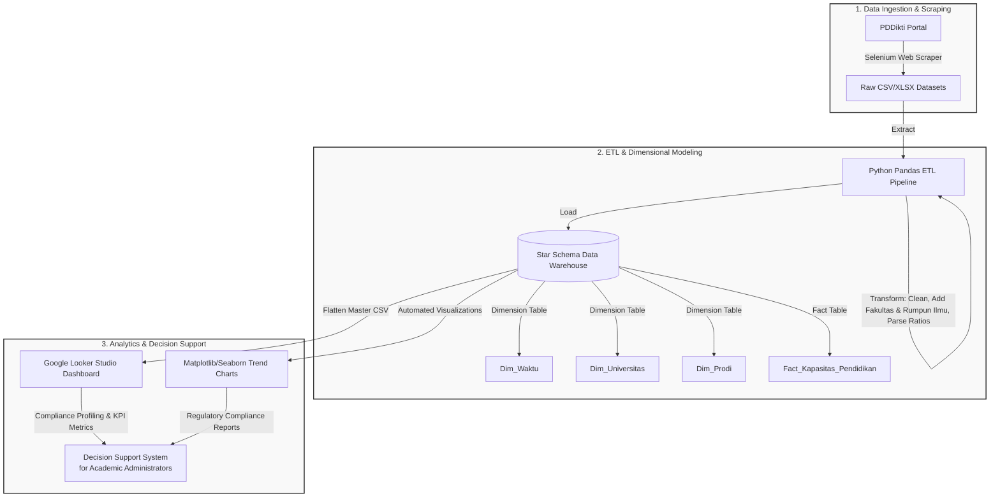

# Academic Capacity Decision Support System (DSS) using Business Intelligence (BI) Roadmap
   
[](https://www.python.org)
[](https://www.selenium.dev)
[](https://pandas.pydata.org)
[](https://lookerstudio.google.com)
[](#)

An end-to-end, academic-grade Business Intelligence (BI) system and Decision Support System (DSS) designed to analyze, monitor, and visualize higher education academic capacity (lecturer-to-student ratios) across **Universitas Siliwangi (UNSIL)** and **53 PTN-BLU** (State Universities - Public Service Bodies) in Indonesia. 

Developed as an undergraduate thesis (*Tugas Akhir*), this project transitions institutional data from static, fragmented reporting into a dynamic, multi-dimensional decision-making resource by implementing the structured **6-Phase Business Intelligence Roadmap** (Moss & Atre, 2003).

---

## 🗺️ System Architecture & Data Flow

The system employs a standard BI architecture that systematically extracts raw web data, processes it through a strict ETL pipeline, stores it in a structured Dimensional Data Warehouse (Star Schema), and serves it to academic leaders via visual analytics and Looker Studio.



---

## 📖 The 6-Phase Business Intelligence Roadmap

This research is structured around the **6-Phase BI Roadmap** by Moss & Atre (2003), ensuring that each technical step has direct academic justification, regulatory alignment, and institutional utility.

### 1. Justification Phase
* **Context**: Higher education quality is highly dependent on institutional capacity. **Permendikbud No. 3 Tahun 2020** enforces strict standards for the **Lecturer-to-Student Ratio**:
  * **1:30** maximum for Science/Technology (Saintek) programs.
  * **1:45** maximum for Social/Humanities (Soshum) programs.
* **Problem**: Currently, academic capacity data is presented statically, making longitudinal trend analysis difficult and blocking proactive compliance monitoring.
* **Objective**: Build a Business Intelligence Decision Support System (DSS) to monitor lecturer-student ratios across reporting semesters, profiling compliant vs. non-compliant study programs based on their respective scientific disciplines.

### 2. Planning Phase
* **Data Sources**: Public data scraped from the official [PDDikti Portal](https://pddikti.kemdiktisaintek.go.id/).
* **Scope**: Longitudinal data spanning **5 semesters** (from *Ganjil 2023* to *Ganjil 2025*) across **53 PTN-BLU** universities, classified into 3 operational zones.

### 3. Business Analysis Phase
The system measures core academic capacity indicators. The primary metric is the **Academic Capacity Ratio**:

$$\text{Capacity Ratio} = \frac{\text{Jumlah Mahasiswa Aktif}}{\text{Jumlah Dosen Penghitung Rasio}}$$

* **Key Analytical Metrics**:
  * **Jumlah Mahasiswa Aktif** (Active Students Count)
  * **Jumlah Dosen Penghitung Rasio** (Calculation-Eligible Lecturers)
  * **Fakultas & Rumpun Ilmu** (Faculty and Discipline: Sains/Sosial) for dynamic filtering.

### 4. Design Phase (Dimensional Modeling)
To support multi-dimensional analysis, the system's Data Warehouse uses a **Star Schema** design, separating factual numeric transactions from descriptive dimensions. It optimizes query execution speeds, simplifies Looker Studio integration, and ensures data integrity.

### 5. Construction Phase (ETL & Visualizations)
The construction phase is automated via a robust Python ETL pipeline:
1. **Extract**: Reads raw scraped CSVs.
2. **Transform**:
   * Clears missing values.
   * Parses string ratios (e.g., `1:42.5` $\rightarrow$ float `42.5`).
   * Maps each program to its **Fakultas** (e.g., Teknik, Ekonomi) and **Rumpun Ilmu** (Sains/Sosial).
3. **Load**: Populates the Star Schema files and generates a flattened master table (`master_looker_unsil.csv`) tailored for Looker Studio.
4. **Automated Data Viz**: Generates and saves analytical charts with dual-threshold DIKTI lines into the `Outputs/Visualizations/` directory.

### 6. Deployment Phase
* **Dashboard Deployment**: The flattened data warehouse is linked to Google Looker Studio, providing interactive, filterable dashboards.
* **Faculty-Level Drilldown**: Users can slice and dice data by Faculty and Discipline (Sains/Sosial) to locate structural bottlenecks.

---

## 🛠️ Installation & Setup

### Prerequisites
* Python 3.8 or higher
* Google Chrome Browser (for Selenium WebDriver)

### 1. Clone & Set Up Virtual Environment
```bash
git clone https://github.com/fauzinoorsyabani/Tugas-Akhir.git
cd "Tugas-Akhir"
python -m venv .venv

# On Windows:
.venv\Scripts\activate
```

### 2. Install Dependencies
```bash
pip install pandas numpy selenium webdriver-manager openpyxl matplotlib seaborn
```

---

## 🚀 Usage Instructions

### Step 1: Run the Web Scraper
```bash
python scrape_pddikti.py
```

### Step 2: Run the ETL Pipeline & Visualizer
To extract the processed scraper results, transform them, map faculties, and auto-generate compliance charts, run:
```bash
python Scripts\run_pipeline.py
```

---

## 📊 Generated Analytical Outputs

Upon executing the pipeline, the system generates premium analytical assets inside `Outputs/Visualizations/`:

1. **Institutional Trends (`viz_institusi.png`)**: A 3-panel line and bar chart showing institutional progress across 5 semesters, featuring dual DIKTI limit lines.
2. **Program Study Heatmap (`heatmap_prodi_semester.png`)**: A color-coded matrix showing the semester-by-semester ratio progression.
3. **Latest Compliance Ranking (`bar_rasio_prodi_terbaru.png`)**: A horizontal bar chart presenting ratios for the latest semester. Programs violating their respective DIKTI limits are highlighted in **red** (Extreme) or **orange** (Warning).
4. **Discipline Comparison (`line_tren_sains_vs_sosial.png`)**: Compares the average burden of Science vs. Social programs against Permendikbud No.3/2020 thresholds.
5. **Dynamic Dashboard Summary (`dashboard_final.png`)**: An aggregated high-resolution dashboard combining institutional trend lines and matrix heatmaps.

---

## ⚖️ Compliance & Decision Support Mechanics (DSS)

The system automatically categorizes and flags study programs based on their calculated capacity ratio against Permendikbud No.3/2020:

| Discipline | Threshold Limit | Action Required if Exceeded |
| :--- | :--- | :--- |
| **Sains / Teknologi** | **Maximum 1:30** | Stop student intake, recruit permanent lab lecturers. |
| **Sosial / Humaniora** | **Maximum 1:45** | Redistribute teaching loads, recruit permanent lecturers. |

Programs exceeding these thresholds are flagged as **🔴 High Risk** in the data warehouse, giving university quality assurance boards (*Lembaga Penjaminan Mutu*) a direct prioritization matrix.

---

## 🎓 Academic Acknowledgments
* **Author**: Fauzi Noor Syabani (NPM: 227007042)
* **Advisors**: Pak Cecep & Pak Irfan
* **Institution**: Universitas Siliwangi (UNSIL), Tasikmalaya, West Java, Indonesia.

---
*Developed with ❤️ as an academic contribution to Universitas Siliwangi's digital governance.*
